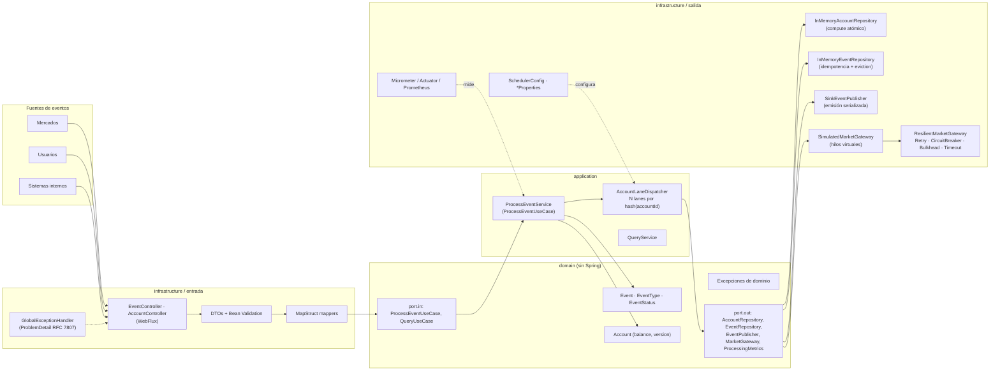
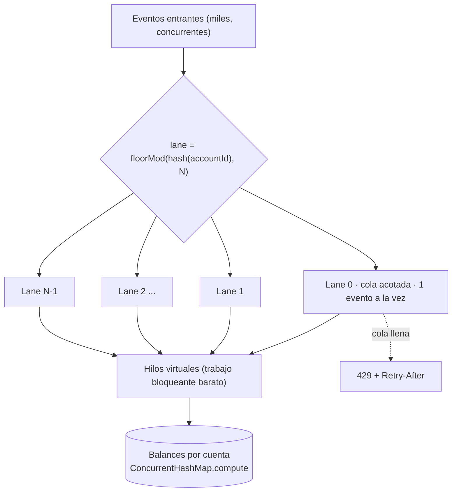
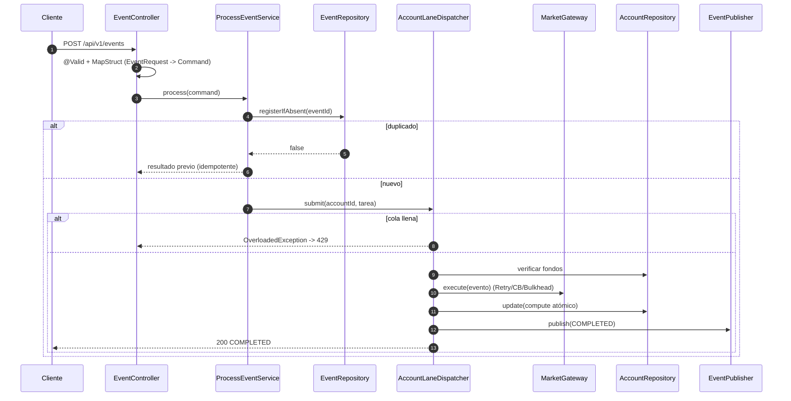

# Optimización de Concurrencia y Paralelismo en Eventos

El sistema de procesamiento de eventos en una plataforma de trading necesita manejar un alto volumen de operaciones simultáneas para mantener la eficiencia y la rapidez en las ejecuciones. El sistema debe asegurar que los eventos se procesen de manera concurrente y paralela para evitar bloqueos y asegurar la fluidez de las operaciones. Los eventos provienen de múltiples fuentes (mercados, usuarios, sistemas internos) y deben ser procesados en tiempo real para actualizar los estados de las cuentas y los balances. El sistema debe manejar la concurrencia de manera eficiente para evitar cuellos de botella y asegurar que las operaciones se completen en el menor tiempo posible.

## Información general

| Campo | Valor |
|-------|-------|
| **Tema** | Gestión de Concurrencia y Paralelismo: Optimizando el Eventos |
| **Nivel** | advanced-l2 |
| **Tipo** | practical |
| **Tiempo estimado** | 8 horas |

## Resumen de la solución

El problema real está en las **cuentas**: muchos eventos concurrentes sobre la *misma* cuenta hacen *read-modify-write* del balance y pierden actualizaciones, mientras que eventos de cuentas *distintas* no se afectan entre sí y deben correr en paralelo. La solución:

* **Lanes por cuenta:** cada evento se enruta a una cola según `floorMod(hash(accountId), N)`. Una lane ejecuta **un evento a la vez y en orden FIFO**; lanes distintas corren **en paralelo**. Exclusión mutua y orden por cuenta sin locks globales ni hilos bloqueados esperando.
* **Hilos virtuales** (Java 21) para el trabajo bloqueante (llamada al mercado): miles de esperas simultáneas casi sin costo.
* **Backpressure explícito:** colas acotadas; si se llenan se responde `429 Too Many Requests` + `Retry-After` en vez de crecer hasta caer por memoria.
* **Segunda línea de defensa:** el balance se actualiza con `ConcurrentHashMap.compute` (atómico por clave) y `Account.apply` es una función pura.
* **Idempotencia** por `eventId` y **resiliencia** (Timeout + Bulkhead + CircuitBreaker + Retry solo de errores transitorios).

## Tecnologías usadas

| Tecnología | Versión | Para qué se usa |
|---|---|---|
| Java | 21 | Records, hilos virtuales (`Thread.ofVirtual()`), `Math.clamp` |
| Spring Boot (WebFlux) | 3.5.6 | API reactiva sobre Netty (no bloqueante) |
| Project Reactor | (BOM de Boot, 3.7.x) | `Mono`/`Flux`, schedulers, `StepVerifier` en tests |
| Resilience4j | 2.2.0 | `CircuitBreaker`, `Bulkhead` (uso programático con `resilience4j-reactor`, sin AOP) |
| MapStruct | 1.6.3 | Mapeo `DTO <-> dominio` (`componentModel=spring`) |
| Bean Validation (Jakarta) | (BOM) | Validación de DTOs de entrada |
| Caffeine | (BOM) | Historial de eventos con tamaño máximo + TTL (idempotencia sin fugas de memoria) |
| Micrometer + Prometheus | (BOM) | Métricas (`/actuator/prometheus`) |
| JUnit 5 / Mockito / AssertJ / Awaitility | (BOM) | Pruebas unitarias, de concurrencia e integración |
| JaCoCo / Sonar Maven plugin | 0.8.13 / 5.1 | Cobertura y análisis de calidad |
| Docker | — | `Dockerfile` multi-stage y `docker-compose.yml` |

Arquitectura **hexagonal** (puertos y adaptadores); el dominio no depende de Spring.

## Mapa de la solución



### Cómo se reparte el trabajo (lanes)



### Flujo de un evento



Más detalle en [`docs/CONCURRENCY_MAP.md`](docs/CONCURRENCY_MAP.md) y [`docs/PERFORMANCE_REPORT.md`](docs/PERFORMANCE_REPORT.md).

## Cómo ejecutar el proyecto

**Requisitos:** JDK 21 y Maven 3.9+. (Si tienes varios JDK: `export JAVA_HOME=$(/usr/libexec/java_home -v 21)` en macOS.)

```bash
mvn clean compile          # compila (verificación de la Fase 0)
mvn clean verify           # compila + todas las pruebas + reporte de cobertura (target/site/jacoco)
mvn spring-boot:run        # arranca la API en http://localhost:8080
```

También como jar o con Docker:

```bash
mvn clean package -DskipTests && java -jar target/events-processing-0.0.1-SNAPSHOT.jar
docker compose up --build   # dos instancias: http://localhost:8081 y http://localhost:8082
```

Pruebas de carga (excluidas del build normal; escriben `target/load-report.md`):

```bash
mvn test -Pload
```

Análisis de Sonar (opcional, requiere un servidor SonarQube):

```bash
mvn clean verify sonar:sonar -Dsonar.host.url=http://localhost:9000 -Dsonar.token=<token>
```

> **Tip con IDEs:** si IntelliJ o VS Code tienen el proyecto abierto y compilan solos, pueden pisar `target/classes` sin procesar MapStruct. Para ejecutar los comandos anteriores deja el IDE sin compilar automáticamente (o ciérralo) y activa "annotation processing" en el IDE.

### Variables de configuración (`application.yml`, sobreescribibles por entorno)

| Propiedad | Por defecto | Efecto |
|---|---|---|
| `app.concurrency.lanes` (`APP_CONCURRENCY_LANES`) | 64 | Cuentas procesadas en paralelo como máximo |
| `app.concurrency.lane-queue-capacity` | 1000 | Eventos en espera por lane antes de responder 429 |
| `app.gateway.min-latency` / `max-latency` | 5ms / 20ms | Latencia simulada del mercado |
| `app.gateway.failure-rate` | 0.0 | Probabilidad de fallo transitorio (pruebas de caos) |
| `app.store.max-events` / `ttl` | 100000 / 1h | Retención del historial / ventana de idempotencia |

## Cómo probar que funciona (curl)

Con la aplicación arrancada (`mvn spring-boot:run`), en otra terminal:

**1. Salud**
```bash
curl -s http://localhost:8080/actuator/health
```
Esperado: `{"status":"UP",...}`

**2. Depósito**
```bash
curl -s -X POST http://localhost:8080/api/v1/events -H 'Content-Type: application/json' \
  -d '{"accountId":"DEMO","eventType":"DEPOSIT","amount":1000.50,"marketSource":"NYSE"}'
```
Esperado: `200` con `"status":"COMPLETED"`.

**3. Consultar el balance**
```bash
curl -s http://localhost:8080/api/v1/accounts/DEMO
```
Esperado: `"balance":1000.5000,"version":1`.

**4. Retiro sin fondos → 422**
```bash
curl -s -i -X POST http://localhost:8080/api/v1/events -H 'Content-Type: application/json' \
  -d '{"accountId":"DEMO","eventType":"WITHDRAWAL","amount":999999,"marketSource":"NYSE"}'
```
Esperado: `HTTP/1.1 422` con `"title":"Insufficient funds"`.

**5. Validación → 400**
```bash
curl -s -i -X POST http://localhost:8080/api/v1/events -H 'Content-Type: application/json' \
  -d '{"accountId":"DEMO","eventType":"DEPOSIT","amount":-5,"marketSource":"NYSE"}'
```
Esperado: `HTTP/1.1 400` con la lista `errors`.

**6. Idempotencia: el mismo `eventId` tres veces se aplica una sola vez**
```bash
for i in 1 2 3; do curl -s -o /dev/null -w "%{http_code}\n" -X POST http://localhost:8080/api/v1/events \
  -H 'Content-Type: application/json' \
  -d '{"eventId":"11111111-1111-1111-1111-111111111111","accountId":"IDEM","eventType":"DEPOSIT","amount":40,"marketSource":"NYSE"}'; done
curl -s http://localhost:8080/api/v1/accounts/IDEM
```
Esperado: tres `200` y `"balance":40.0000,"version":1`.

**7. Lote**
```bash
curl -s -X POST http://localhost:8080/api/v1/events/batch -H 'Content-Type: application/json' -d '{
  "maxConcurrency": 8,
  "events": [
    {"accountId":"B1","eventType":"DEPOSIT","amount":10,"marketSource":"NYSE"},
    {"accountId":"B1","eventType":"DEPOSIT","amount":10,"marketSource":"NYSE"},
    {"accountId":"B2","eventType":"WITHDRAWAL","amount":99,"marketSource":"NYSE"}
  ]}'
```
Esperado: `"total":3,"completed":2,"failed":1`.

**8. La prueba clave: 200 retiros concurrentes sobre la misma cuenta**
```bash
curl -s -X POST http://localhost:8080/api/v1/events -H 'Content-Type: application/json' \
  -d '{"accountId":"RACE","eventType":"DEPOSIT","amount":1000,"marketSource":"NYSE"}' > /dev/null
seq 1 200 | xargs -P 50 -I{} curl -s -o /dev/null -w "%{http_code}\n" -X POST http://localhost:8080/api/v1/events \
  -H 'Content-Type: application/json' \
  -d '{"accountId":"RACE","eventType":"WITHDRAWAL","amount":10,"marketSource":"NYSE"}' | sort | uniq -c
curl -s http://localhost:8080/api/v1/accounts/RACE
```
Esperado: **exactamente** `100 × 200` y `100 × 422`, balance final `0.0000` (jamás negativo) y `version:101`. Sin la sincronización por lanes el resultado variaría en cada ejecución.

**9. Stream en vivo (SSE)** — en una terminal:
```bash
curl -N http://localhost:8080/api/v1/events/stream
```
y en otra repite el depósito del paso 2: verás llegar el evento.

**10. Métricas**
```bash
curl -s http://localhost:8080/actuator/prometheus | grep -E "^events_"
```

**11. Backpressure (429) y caos** — arranca con una sola lane, cola corta y mercado lento:
```bash
APP_CONCURRENCY_LANES=1 APP_CONCURRENCY_LANE_QUEUE_CAPACITY=3 \
APP_GATEWAY_MIN_LATENCY=200ms APP_GATEWAY_MAX_LATENCY=200ms mvn spring-boot:run
```
```bash
seq 1 20 | xargs -P 20 -I{} curl -s -o /dev/null -w "%{http_code}\n" -X POST http://localhost:8080/api/v1/events \
  -H 'Content-Type: application/json' \
  -d '{"accountId":"HOT","eventType":"DEPOSIT","amount":1,"marketSource":"NYSE"}' | sort | uniq -c
```
Esperado: varios `200` y varios `429` (respuesta rápida con cabecera `Retry-After`), sin caída del servicio. Para el circuit breaker: `APP_GATEWAY_FAILURE_RATE=0.9 mvn spring-boot:run` y envía eventos; tras varios fallos responderá `503` con "circuit breaker is open".

---

## Fases del reto y cómo las resolví

### Fase 0: Configuración del Proyecto

**Objetivo:** Obtener el proyecto base funcional enviando el Código Base a un asistente de IA, que lo analizará, corregirá errores y generará un ZIP listo para usar.

**Tiempo estimado:** 15-30 minutos

**Instrucciones:**

- Asegúrate de tener instalado para ejecutar el proyecto: JDK 17+, Maven 3.9+, IDE con soporte Java.
- Copia todo el contenido del campo **Código Base** de este reto — incluyendo el texto de instrucciones que aparece al inicio.
- Abre un asistente de IA (Claude en claude.ai, ChatGPT o Gemini — se recomienda Claude), pega el contenido copiado en el chat y envíalo.
- El asistente analizará los archivos, corregirá errores y generará un archivo ZIP descargable. Descárgalo y extráelo en la carpeta donde quieras trabajar.
- Ejecuta `mvn compile` en la raíz. Si no hay errores, estás listo.

**Entregable:** El proyecto compila/arranca sin errores.

**Cómo lo resolví**

El código base **no compilaba** y, además, sus pruebas describían una API que no existía. Diagnostiqué los errores y corregí lo que impedía compilar/arrancar:

* `pom.xml`: quité las versiones de `reactor-core`/`reactor-test` (las gestiona el BOM de Boot y chocaban), agregué `spring-boot-starter-validation`, MapStruct, Caffeine, Micrometer-Prometheus, JaCoCo y el plugin de Sonar, y reemplacé `resilience4j-spring-boot3` por los módulos que realmente uso (`circuitbreaker`, `bulkhead`, `reactor`) para no depender de AOP (con el starter, `@CircuitBreaker` se ignoraba en silencio sin `spring-boot-starter-aop`).
* Imports inexistentes (`reactor.retry.Retry` → `reactor.util.retry.Retry`, `EventType` que no existía como tipo propio, `Scheduler` sin importar).
* `application.yml`: faltaba `spring.application.name` (rompía la expresión `${spring.application.name}` de las métricas), quité `allow-bean-definition-overriding` que escondía beans duplicados y enlacé los parámetros a `@ConfigurationProperties` reales.
* El procesador de anotaciones de MapStruct se configuró en `maven-compiler-plugin` (y `testCompile` sin procesadores para evitar que se recompile la implementación generada).
* **Entregable cumplido:** `mvn clean compile` y `mvn spring-boot:run` funcionan.

### Fase 1: Identificación de Puntos de Concurrencia

**Objetivo:** Mapear las áreas del sistema donde la concurrencia es crítica y puede introducir bloqueos.

**Tiempo estimado:** 2 horas

**Instrucciones:**

- Analiza el flujo de eventos desde su origen hasta su procesamiento final.
- Identifica los puntos donde múltiples eventos pueden llegar simultáneamente y cómo esto puede afectar el rendimiento.
- Documenta las áreas críticas y propone posibles soluciones para manejar la concurrencia de manera eficiente.

**Entregable:** Mapa de concurrencia con puntos críticos documentados y propuestas de solución.

**Cómo lo resolví**

Documenté el mapa en [`docs/CONCURRENCY_MAP.md`](docs/CONCURRENCY_MAP.md): el flujo origen→destino, los recursos compartidos mutables y 12 puntos críticos (P1–P12) con riesgo, solución, clase que la implementa y la prueba que la demuestra. El hallazgo principal: el código base **no tenía modelo de cuentas/balances**, así que la sección crítica real (el *read-modify-write* del balance) no existía; la modelé (`Account`) y la protegí. Además encontré y eliminé bugs sembrados, por ejemplo:

* Un semáforo que se liberaba aunque nunca se hubiera adquirido (el límite dejaba de proteger).
* `retryWhen` que reintentaba también errores de validación y de saturación (amplificaba la carga justo en la saturación).
* Pools con cola enorme (el `max` nunca se usa), `CallerRunsPolicy` ejecutando trabajo en el hilo de Netty, colas con `Integer.MAX_VALUE`.
* Un `Sink` al que se emitía desde varios hilos sin serializar (`FAIL_NON_SERIALIZED` pierde eventos).
* Un `ConcurrentHashMap` de eventos que crecía sin límite y con clave `String` para ids `UUID` (la consulta nunca encontraba nada).

### Fase 2: Implementación de Hilos y Sincronización

**Objetivo:** Implementar hilos de ejecución para manejar eventos concurrentes y asegurar la sincronización adecuada.

**Tiempo estimado:** 3 horas

**Instrucciones:**

- Crea hilos de ejecución para manejar diferentes flujos de eventos de manera concurrente.
- Implementa mecanismos de sincronización para asegurar que los recursos compartidos se accedan de manera segura.
- Prueba la implementación para asegurar que los eventos se procesan de manera eficiente y sin bloqueos.

**Entregable:** Implementación de hilos y sincronización con pruebas de rendimiento.

**Cómo lo resolví** — clases y métodos, en el orden en que viaja un evento:

| Pieza | Qué hace / qué problema del reto resuelve |
|---|---|
| `EventController.receive` / `receiveBatch` (`infrastructure/web/controller`) | Adaptador HTTP sin lógica de negocio: valida (`@Valid`), mapea con MapStruct y delega en el caso de uso. `receiveBatch` acota el tamaño del lote y delega la concurrencia al servicio. |
| `EventRequest`, `BatchEventRequest`, `EventResponse`, `AccountResponse` (`web/dto`) + `EventWebMapper`, `AccountWebMapper` (`web/mapper`) | DTOs inmutables (records) con Bean Validation; MapStruct traduce `DTO <-> dominio` para no exponer el dominio. |
| `ProcessEventService.process` (`application/service`) | Orquesta el caso de uso: `Event.validate()` → `EventRepository.registerIfAbsent` (idempotencia) → `AccountLaneDispatcher.submit`. |
| `ProcessEventService.executeInLane` | Corre **dentro de la lane**: verifica fondos (`checkFunds`), llama al mercado, aplica el balance con `AccountRepository.update`, guarda y publica. Cada paso va en `Mono.defer` para que se evalúe al suscribirse y en orden (un bug real que detectó una prueba). Cualquier error marca el evento `FAILED` (`recordFailure`), nunca queda colgado en `PROCESSING`. |
| `ProcessEventService.processBatch` | `flatMap(..., concurrency)` con la concurrencia acotada (`Math.clamp`) al límite configurado; los fallos individuales no abortan el lote. |
| **`AccountLaneDispatcher`** (`application/concurrency`) | **El núcleo.** `laneIndex(key)` = `floorMod(hash ^ hash>>>16, N)`. Cada `Lane` tiene una `ArrayBlockingQueue` acotada y un contador `pending`: solo se agenda un `runNext` cuando pasa de 0 a 1 y cada fin de tarea agenda la siguiente → una tarea a la vez por lane, FIFO. `submit` devuelve `OverloadedException` si la cola está llena. `Job.cancel` descarta tareas canceladas; si el scheduler se apaga, `failPending` falla lo encolado en vez de colgarlo. |
| `SchedulerConfig.virtualThreadScheduler` (`infrastructure/config`) | `Schedulers.fromExecutorService` sobre hilos virtuales: el trabajo bloqueante es barato y no toca el event loop. `accountLaneDispatcher` crea el despachador con `ConcurrencyProperties`. |
| `Account.apply` (`domain/model`) | Función pura e inmutable: calcula el nuevo balance, lanza `InsufficientFundsException` si quedaría negativo, incrementa `version`. |
| `InMemoryAccountRepository.update` | `ConcurrentHashMap.compute`: segunda línea de defensa; la actualización es atómica por cuenta aunque algo saltara la lane. |
| `InMemoryEventRepository.registerIfAbsent` | `putIfAbsent` atómico sobre un caché Caffeine (tamaño máximo + TTL): idempotencia sin fugas de memoria. |
| `SimulatedMarketGateway.execute` | Cliente de mercado simulado (bloqueante, `Thread.sleep`) ejecutado en hilos virtuales; fallos solo por configuración (`failure-rate`), nunca `Math.random` en el camino de producción. |
| `ResilientMarketGateway.execute` + `ResilienceConfig` | `Retry(CircuitBreaker(Bulkhead(timeout(llamada))))` con operadores de Resilience4j. **Solo** reintenta `TransientProcessingException` (backoff + jitter). Mapea `BulkheadFullException` → `OverloadedException` (429) y circuito abierto → `GatewayUnavailableException` (503). |
| `SinkEventPublisher.emit` | Publicación pub/sub: reintenta en spin ante `FAIL_NON_SERIALIZED` para no perder eventos cuando varias lanes publican a la vez; `directBestEffort` para que un suscriptor lento no frene el procesamiento. |
| `GlobalExceptionHandler` | Traduce excepciones a `ProblemDetail` (RFC 7807): 400, 404, 422, 429/503 con `Retry-After`, 500 sin filtrar detalles internos. |
| `Event` (`domain/model`) | Record inmutable con máquina de estados `RECEIVED → PROCESSING → COMPLETED/FAILED` (se permite `RECEIVED → FAILED` para rechazos previos), `validate()` y dinero en `BigDecimal` con máx. 4 decimales; `timestamp` en `Instant`. |

**Pruebas de sincronización** (79 pruebas, ~97 % de cobertura de instrucciones):

* `AccountLaneDispatcherTest`: la misma clave nunca se solapa y conserva el orden (`@RepeatedTest(5)`); lanes distintas corren en paralelo; cola llena ⇒ rechazo; cancelación; errores no bloquean la lane.
* `ProcessEventServiceTest`: **1000 depósitos concurrentes** a la misma cuenta suman exactamente 1000; **300 retiros** con 100 de fondos ⇒ exactamente 100 éxitos y balance 0; orden depósito→retiro; idempotencia con 100 envíos en paralelo; fallo del mercado no toca el balance.
* `InMemoryAccountRepositoryTest.naiveReadModifyWriteLosesUpdates`: **demuestra el bug** (lost update determinista con un `CyclicBarrier`) y que `update` atómico no lo tiene.
* `SinkEventPublisherTest`: 32 hilos × 10 000 eventos sin pérdida.
* `ResilientMarketGatewayTest`: reintento, no-reintento de no transitorios, circuit breaker, bulkhead, timeout.
* `EventApiIntegrationTest` / `OverloadApiIntegrationTest`: contexto completo con HTTP real, 500 peticiones concurrentes, SSE, métricas y saturación con 429.

### Fase 3: Optimización y Escalabilidad

**Objetivo:** Optimizar la implementación para manejar un mayor volumen de eventos y asegurar la escalabilidad del sistema.

**Tiempo estimado:** 3 horas

**Instrucciones:**

- Analiza el rendimiento de la implementación actual y identifica áreas de mejora.
- Implementa mejoras para optimizar el procesamiento de eventos y asegurar que el sistema pueda manejar un mayor volumen de eventos.
- Realiza pruebas de carga para verificar la escalabilidad de la implementación.

**Entregable:** Implementación optimizada con pruebas de carga y resultados de rendimiento.

**Cómo lo resolví**

* **Línea base y medición:** `ThroughputLoadTest` (`src/test/.../load`, `mvn test -Pload`) mide throughput y latencia p50/p95/p99 variando lanes y distribución de cuentas con un mercado de 10 ms. `lanes = 1` equivale a un lock global y es la línea base. Resultados y análisis en [`docs/PERFORMANCE_REPORT.md`](docs/PERFORMANCE_REPORT.md).
* **Optimización:** de serializar todo (lock global) a serializar solo por cuenta; hilos virtuales para el trabajo bloqueante; colas acotadas; el parámetro `app.concurrency.lanes` permite ajustar el paralelismo sin recompilar.
* **Escalabilidad / observabilidad:** `LaneMetricsBinder` (`events_lanes_queued`, `events_lanes_max_depth`, `events_lanes_count`) y `MicrometerProcessingMetrics` (`events_received`, `events_completed`, `events_failed{reason}`, `events_rejected`, `events_duplicated`, `events_processing_duration`) exponen la presión del sistema en `/actuator/prometheus`.
* **Escalado horizontal:** `Dockerfile` multi-stage y `docker-compose.yml` con dos instancias. Todos los eventos de una misma cuenta deben ir a la misma instancia (partición por `accountId`, p. ej. Kafka con `key = accountId`); documentado en `docs/CONCURRENCY_MAP.md`.
* **Límite conocido:** una cuenta caliente se procesa a `1 / latencia` eventos/s por diseño (se mide en el reporte); la mitigación posible es agrupar eventos de la misma cuenta (microbatching), no implementada.

## Dimensiones evaluadas

- **queEs**: ¿Qué es la concurrencia y cómo se diferencia del paralelismo en el contexto de este reto?
- **paraQueSirve**: ¿Para qué sirve manejar la concurrencia y el paralelismo en el procesamiento de eventos?
- **comoSeUsa**: ¿Cómo se pueden implementar hilos y mecanismos de sincronización para manejar eventos concurrentes?
- **erroresComunes**: ¿Cuáles son los errores comunes al manejar concurrencia y paralelismo y cómo se pueden evitar?
- **queDecisionesImplica**: ¿Qué decisiones implica la optimización de la concurrencia y el paralelismo en el procesamiento de eventos?

## Criterios de evaluación

- Identificación correcta de puntos de concurrencia crítica → [`docs/CONCURRENCY_MAP.md`](docs/CONCURRENCY_MAP.md).
- Implementación efectiva de hilos y sincronización → `AccountLaneDispatcher`, `InMemoryAccountRepository`, `ResilientMarketGateway`.
- Optimización y escalabilidad del sistema para manejar un mayor volumen de eventos → `ThroughputLoadTest`, [`docs/PERFORMANCE_REPORT.md`](docs/PERFORMANCE_REPORT.md).

## Estructura del proyecto

```
com.trading.events
├── domain
│   ├── model        Event, EventType, EventStatus, Account, ProcessingResult
│   ├── exception    EventProcessingException (base), InvalidEvent, InsufficientFunds,
│   │                TransientProcessing, Overloaded, GatewayUnavailable, ResourceNotFound
│   └── port
│       ├── in       ProcessEventUseCase, QueryUseCase, ProcessEventCommand
│       └── out      AccountRepository, EventRepository, EventPublisher, MarketGateway, ProcessingMetrics
├── application
│   ├── concurrency  AccountLaneDispatcher
│   └── service      ProcessEventService, QueryService, ProcessingLimits
└── infrastructure
    ├── web          controller/, dto/, mapper/ (MapStruct), advice/GlobalExceptionHandler
    ├── persistence  InMemoryAccountRepository, InMemoryEventRepository
    ├── messaging    SinkEventPublisher
    ├── gateway      SimulatedMarketGateway, ResilientMarketGateway
    ├── metrics      MicrometerProcessingMetrics, LaneMetricsBinder
    └── config       ConcurrencyProperties, GatewayProperties, StoreProperties,
                     SchedulerConfig, ResilienceConfig, GatewayConfig
```
