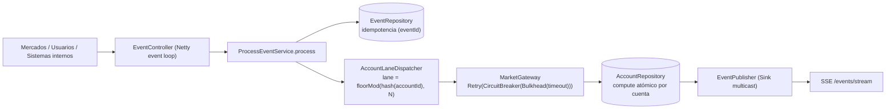

# Mapa de concurrencia (Fase 1)

Entregable de la Fase 1: dónde la concurrencia es crítica en el flujo de eventos, qué riesgo introduce, cómo se resolvió y qué prueba lo demuestra.

## 1. Flujo de un evento y recursos compartidos

Recursos **compartidos y mutables** (donde pueden aparecer carreras):

| Recurso | Quién lo toca | Riesgo |
|---|---|---|
| Balance de una cuenta | Todos los eventos de esa cuenta | *Lost update*, saldo negativo, orden roto |
| Registro de `eventId` | Cualquier reenvío del mismo evento | Doble aplicación |
| Sink de publicación | Todas las lanes a la vez | Emisión no serializada (pérdida de eventos) |
| Colas / pools | Todo el tráfico | Crecimiento sin límite (OOM), latencia sin techo |
| Event loop de Netty | Todas las peticiones HTTP | Bloquearlo congela la API completa |
| Mercado externo | Todas las lanes | Cascada de fallos, tormenta de reintentos |

## 2. Puntos críticos, propuesta y solución implementada

| ID | Punto crítico | Riesgo | Solución implementada | Dónde | Prueba que lo demuestra |
|---|---|---|---|---|---|
| P1 | Read-modify-write del balance | Se pierden actualizaciones: dos depósitos de 100 dejan 100 en vez de 200 | (1) Lanes: un solo evento por cuenta a la vez. (2) Respaldo: `ConcurrentHashMap.compute` atómico + `Account.apply` pura | `AccountLaneDispatcher`, `InMemoryAccountRepository.update` | `naiveReadModifyWriteLosesUpdates` (demuestra el bug), `atomicUpdateNeverLosesWrites`, `noLostUpdatesOnSameAccount` (1000 depósitos) |
| P2 | Orden de eventos de una cuenta | Un retiro adelanta a su depósito y falla | Cola FIFO por lane; misma cuenta ⇒ misma lane | `AccountLaneDispatcher.Lane` | `sameKeyIsSerializedAndOrdered`, `preservesPerAccountOrder` |
| P3 | Saldo negativo bajo carga | Sobregiro por chequeo + escritura no atómicos | Invariante en `Account.apply` + verificación previa dentro de la lane | `Account.apply`, `ProcessEventService.checkFunds` | `balanceNeverGoesNegative` (300 retiros, 100 fondos) |
| P4 | Duplicados / reintentos de cliente | Un evento se aplica dos veces | Idempotencia atómica con `putIfAbsent` por `eventId` | `InMemoryEventRepository.registerIfAbsent` | `onlyOneRegistrationWins` (200 hilos), `duplicateEventsApplyOnce` |
| P5 | Colas ilimitadas | OOM bajo ráfagas | Cola acotada por lane; al llenarse `OverloadedException` ⇒ HTTP 429 + `Retry-After` | `AccountLaneDispatcher.submit` | `rejectsWhenLaneIsFull`, `rejectsExcessWith429AndKeepsAcceptedConsistent` |
| P6 | Bloquear el event loop | La API entera deja de responder | Trabajo bloqueante en hilos virtuales; nada de `block()`/`sleep` en hilos de Netty | `SchedulerConfig.virtualThreadScheduler`, `SimulatedMarketGateway` | `appliesLatencyWithinRangeOnAVirtualThread` |
| P7 | Emisión concurrente al `Sink` | `FAIL_NON_SERIALIZED`: eventos perdidos | Reintento (spin) hasta serializar; `directBestEffort` para no frenar por un suscriptor lento | `SinkEventPublisher.emit` | `concurrentPublishersLoseNothing` (32 hilos × 10 000) |
| P8 | Mercado lento o caído | Cascada de fallos, reintentos masivos | Timeout + Bulkhead + CircuitBreaker; **Retry solo de errores transitorios** con backoff y jitter | `ResilientMarketGateway` | `retriesTransientFailures`, `doesNotRetryNonTransient`, `circuitBreakerOpens`, `bulkheadRejectsExcess` |
| P9 | Historial sin límite | Fuga de memoria | Caffeine con tamaño máximo + TTL | `InMemoryEventRepository` | `InMemoryEventRepositoryTest` |
| P10 | Fallo a mitad de proceso | Evento colgado en `PROCESSING`, balance a medias | Cada paso se evalúa con `Mono.defer`; cualquier error marca el evento `FAILED` y el balance solo cambia al final | `ProcessEventService.executeInLane` / `recordFailure` | `gatewayFailureDoesNotTouchBalance`, `unexpectedErrorMarksFailed` |
| P11 | Cancelación del cliente | Tarea huérfana que retiene la lane | `Job.cancel` descarta tareas en cola y cancela las que corren | `AccountLaneDispatcher.Job` | `cancelledQueuedTaskIsSkipped`, `cancelInFlightReleasesLane` |
| P12 | Observabilidad | No se ve la saturación | Gauges de cola/lane más profunda y contadores por motivo | `LaneMetricsBinder`, `MicrometerProcessingMetrics` | `exposesMetrics` |

## 3. Invariantes que el sistema garantiza

1. El balance de una cuenta es la suma exacta de los eventos aplicados con éxito, en el orden recibido.
2. El balance nunca es negativo.
3. Un `eventId` se aplica como máximo una vez.
4. Ninguna cola es ilimitada; ante saturación se rechaza rápido.
5. Ningún hilo del event loop se bloquea.
6. Un fallo no deja el balance a medias ni el evento en un estado intermedio.

## 4. Límites conocidos (decisiones conscientes)

* **Cuenta caliente:** una sola cuenta se procesa a `1 / latencia` eventos por segundo (está serializada por diseño). Ver `PERFORMANCE_REPORT.md`. Mitigaciones posibles: microbatching por cuenta, reducir latencia del mercado.
* **Estado en memoria:** al reiniciar se pierde. La persistencia está detrás de los puertos `AccountRepository` / `EventRepository`; reemplazarla (R2DBC, etc.) no toca dominio ni aplicación.
* **Escalado horizontal:** requiere que todos los eventos de una cuenta lleguen a la misma instancia (partición por `accountId`, p. ej. Kafka con `key = accountId`).
